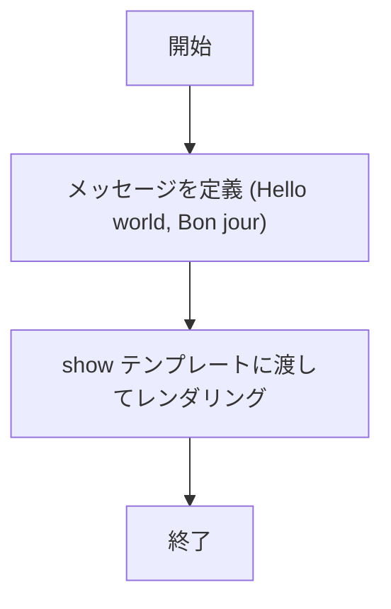
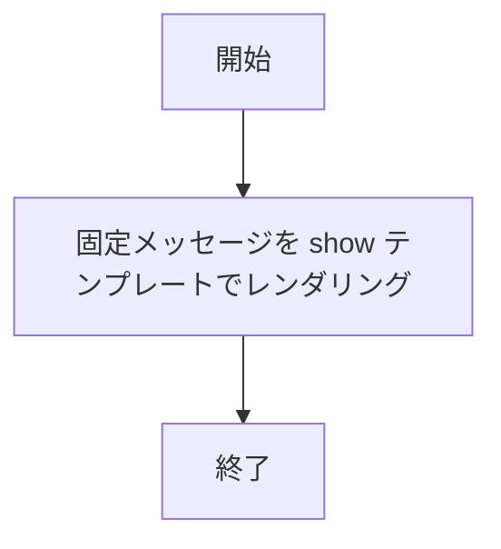
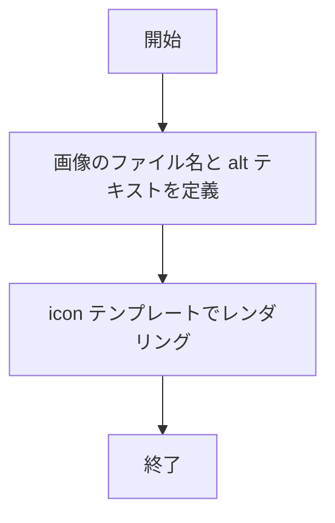
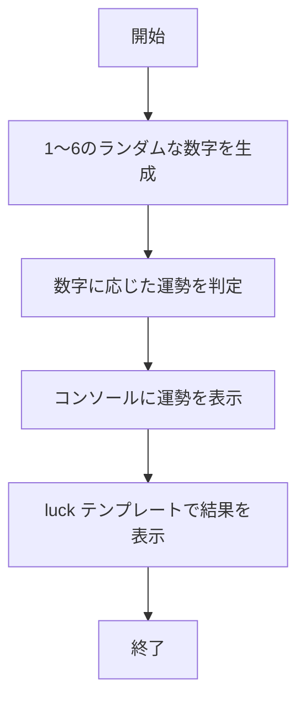
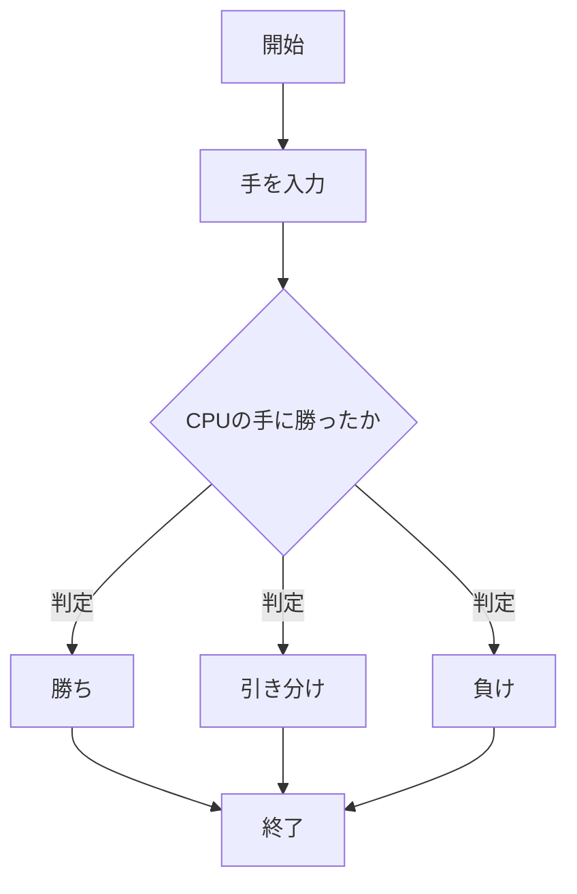
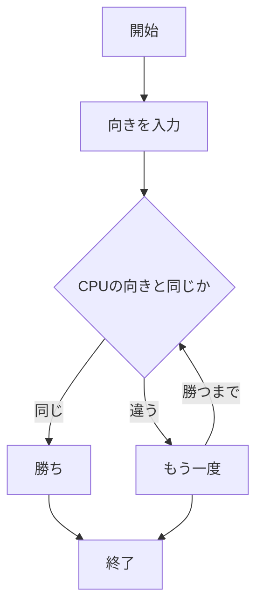
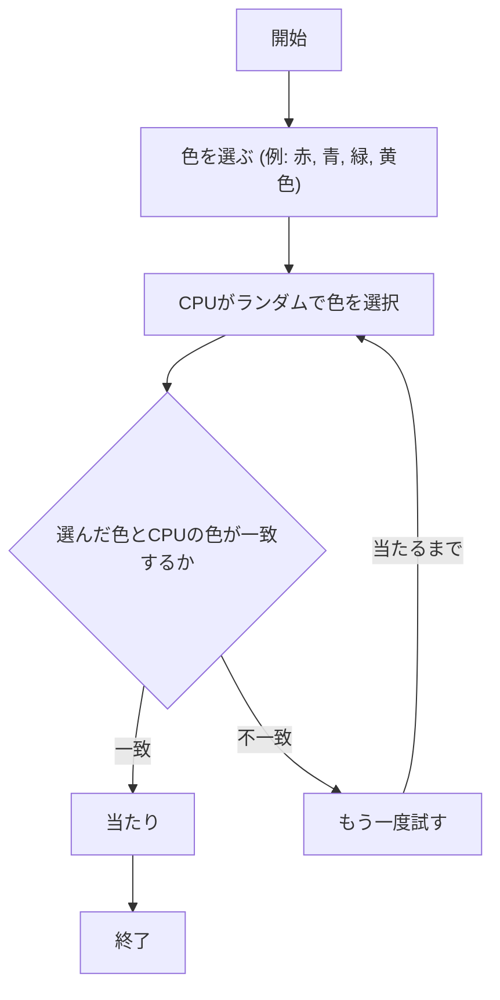

# webpro_06
11月18日

## このプログラムについて

## ファイル一覧
ファイル名 | 説明
-|-
app5.js | プログラム本体
public/janken.html | ジャンケンの開始画面
public/hoi.html | あっち向いてホイの開始画面  
views/show.ejs | hello1, 2のテンプレートファイル
views/icon.ejs | iconのテンプレートファイル
views/luck.ejs | 運勢のテンプレートファイル
views/janken.ejs | ジャンケンのテンプレートファイル
views/hoi.ejs | あっち向いてホイのテンプレートファイル
views/lottery.ejs | くじ引きのテンプレートファイル
README.md | app5.js全体のドキュメント

```javascript
console.log('Hello');
```
## 起動方法

1. webpro_06のディレクトリにcdコマンドで移動しターミナルで
```javascript
node app5.js
```
と記述し起動する．
1. Webブラウザでlocalhost:8080/public/janken.htmlにアクセスする．あっち向いてホイとくじ引きをしたい場合はlocalhost:8080/public/janken.htmlのjankenの部分をhoiかlotteryに変更することで起動できる．
## 動作手順

**ジャンケン場合**「何を出す？」と聞かれているのでグー，チョキ，パーの中から一つ記述し，送信を押す
**あっち向いてホイの場合**「何を出す？」と聞かれているので，上，下，右，左の中から一つ記述し，送信を押す．
**くじ引きの場合**「色を選択:」と書かれているので赤，青，緑，黄色の中から一つ選び，くじを引くを押す．


## 図の描画

## hello1


###　詳細説明

動的に定義された2つのメッセージ (Hello world, Bon jour) を show テンプレートに渡して表示する

## hello2


###　詳細説明

固定のメッセージ (Hello world, Bon jour) を show テンプレートに渡して表示する

## icon


### 詳細説明

Appleのロゴ画像ファイル (./public/Apple_logo_black.svg)とaltテキストをiconテンプレートに渡して表示する

## luck


### 詳細説明

サイコロを振るような形で1～6の数字をランダムに生成し，その結果に応じて運勢 (大吉, 中吉, など) を表示する

## ジャンケン


### 詳細説明

1. **開始**:処理の開始を示している(勝負の開始)
1. **text**:「グー」「チョキ」「パー」の一つを入力
1. **条件に合うか**:ユーザーとCPUのじゃんけんの手を比較して条件判定を行う
1. **結果**:条件を満たした場合は「勝ち」，それ以外の判定はCPUと同じ手なら「引き分け」，「勝ち」「引き分け」のどれにも当てはまらない条件なら負けとなる
1. **終了**:CPUに「勝ち」「負け」「引き分け」のどれかになり処理が終了する

## あっち向いてホイ



###　詳細説明

1. **開始**:処理の開始(ゲームの開始)
1. **text**:「上」「下」「右」「左」の向きを一つ入力
1. **CPUの向きと合うか**:CPUと同じ向きなら「勝ち」となり向きが一致しない場合は「もう一度」となる
1. **終了**:CPUと向きがあったら「勝ち」となり処理を終了する

## くじ引き


### 詳細説明

1. **開始**:処理の開始(くじ引きの開始)
1. **ユーザーの選択**:ユーザーが「赤」「青」「緑」「黄色」の中から色を選ぶ
1. **CPUのランダム選択**:CPUがランダムで1つの色（赤，青，緑，黄色）を選ぶ
1. **判定**:ユーザーが選んだ色とCPUの色を比較し，一致するかどうかを判定する
**一致した場合**:ユーザーが「当たり」となりゲーム終了
**不一致の場合**:「もう一度試す」ループに戻り，再度CPUが色を選ぶ
1. **終了**:ユーザーが当たるまで繰り返し，当たったらゲームを終了する


