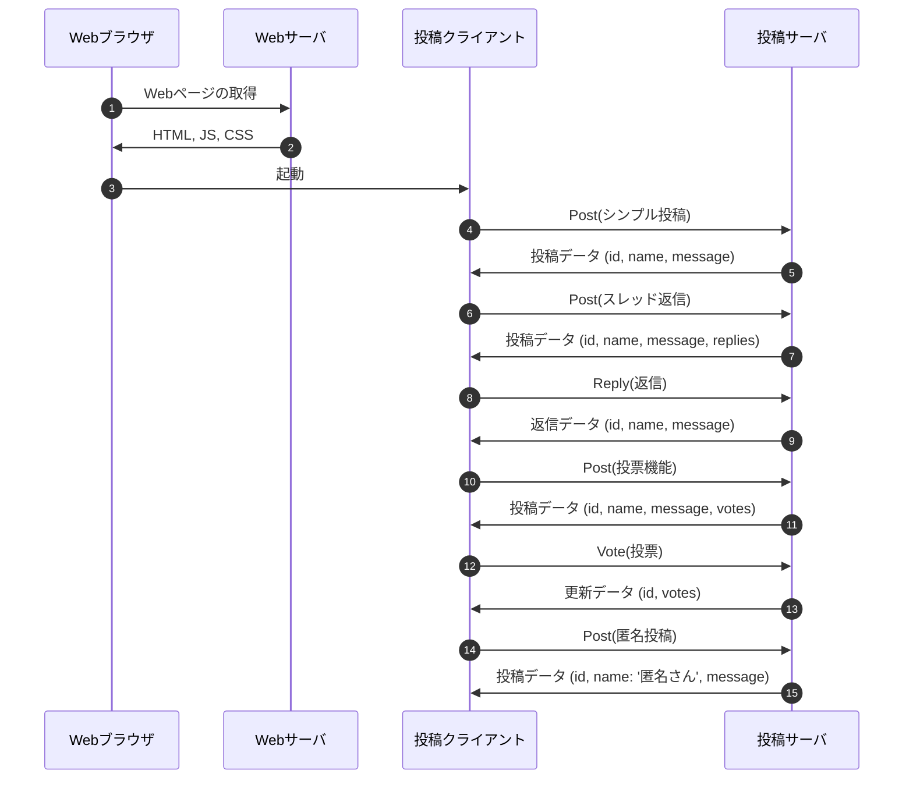

```mermaid
sequenceDiagram
  autonumber
  Webブラウザ ->> Webサーバ: Webページの取得
  Webサーバ ->> Webブラウザ: HTML, JS, CSS
  Webブラウザ ->> 投稿クライアント: 起動
  投稿クライアント ->> 投稿サーバ: Post(シンプル投稿)
  投稿サーバ ->> 投稿クライアント: 投稿データ (id, name, message)
  投稿クライアント ->> 投稿サーバ: Post(スレッド返信)
  投稿サーバ ->> 投稿クライアント: 投稿データ (id, name, message, replies)
  投稿クライアント ->> 投稿サーバ: Reply(返信)
  投稿サーバ ->> 投稿クライアント: 返信データ (id, name, message)
  投稿クライアント ->> 投稿サーバ: Post(投票機能)
  投稿サーバ ->> 投稿クライアント: 投稿データ (id, name, message, votes)
  投稿クライアント ->> 投稿サーバ: Vote(投票)
  投稿サーバ ->> 投稿クライアント: 更新データ (id, votes)
  投稿クライアント ->> 投稿サーバ: Post(匿名投稿)
  投稿サーバ ->> 投稿クライアント: 投稿データ (id, name: '匿名さん', message)
```